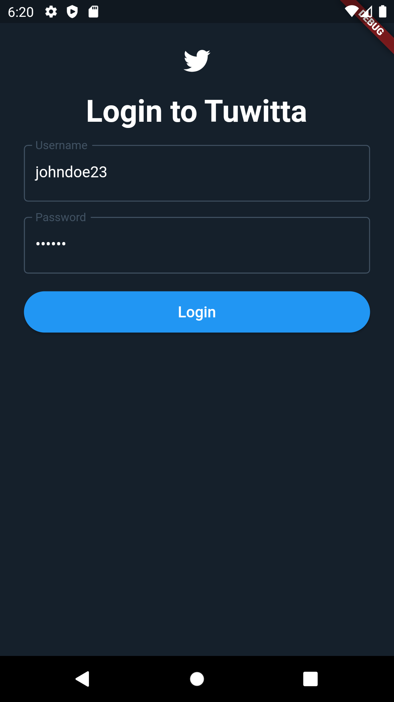
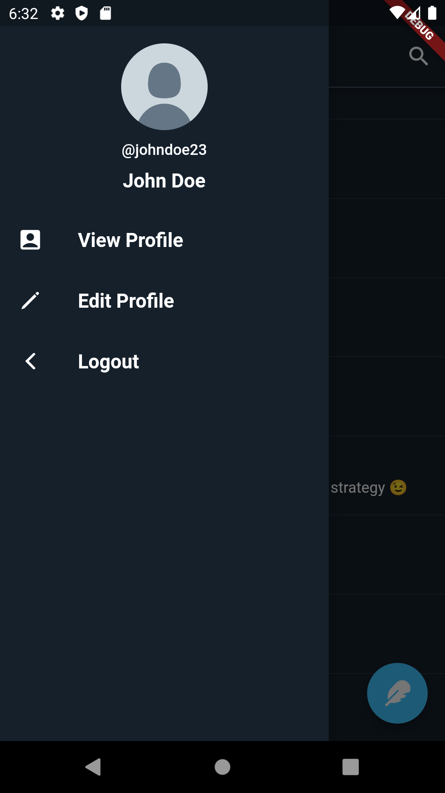

# CMSC 23 Project
### Jeb Wilfred D. Panganiban
### 2019-02410
### WX-4L

# Happy Paths

## Logging in

### To reproduce
- From the initial page, click on Login button
- Enter valid username
- Enter valid password associated with username
- Click the login button

## Creating an account

### To reproduce
- From the initial page, click on Register button
- Fill required input fields

### Result
- New account is created and you are redirected to the feed

## Viewing Own Profile

### To reproduce
- In the feed page, click the avatar icon on the top-left corner of the page
- Click on View Profile

### Result
- The user's avatar, username, full name, and created posts are displayed

## Editing Own Profile

### To reproduce
- In the feed page, click the avatar icon on the top-left corner of the page
- Click on Edit Profile
- Fill input fields that you want to update
- Click Save

### Result
- Your user information is updated

## Viewing a Post

### To reproduce
- In the feed page, click on a post you want to view

### Result
- You can now see more about the post, its replies, and you can also create a reply

## Creating a Post

### To reproduce
- In the feed page, click on the floating action button with the quill icon

### Result
- You are shown an input dialog. Enter the content of the post in the dialog and click Post.

## Editing a Post

### To reproduce
- In your profile page, click on the pencil icon to edit the post you want to update.
- An input dialog is shown. Add the new content on the input field.
- Click the Save button.

### Results
- The post you edited is now updated.

## Deleting a Post

### To reproduce
- In your profile page, click on the trash icon to edit the post you want to delete.

### Results
- The post is now deleted.

## Replying to a Post

### To reproduce
- In the feed page, click on a post.
- Add your reply content to the input field at the bottom of the page.
- Click the Reply button

### Result
- A new reply is added to the post.

## Searching for a User

### To reproduce
- In the feed page, click on the search button on the upper-right corner of the page.
- Add the username of the user you want to search on the input field.
- Click Search.

### Result
- The user's information such as his/her username and full name is displayed, along with the user's public posts.

## Logging out

### To reproduce
- In the feed page, click on the avatar icon on the upper-left corner of the page.
- Click on Logout.

### Result
- You are now logged out and brought back to the initial page.

# Unhappy Paths

## Logging in with invalid credentials

### To reproduce
- In the login page, log in with invalid username and password.

### Result
- A popup indicating that the username or password used is shown.